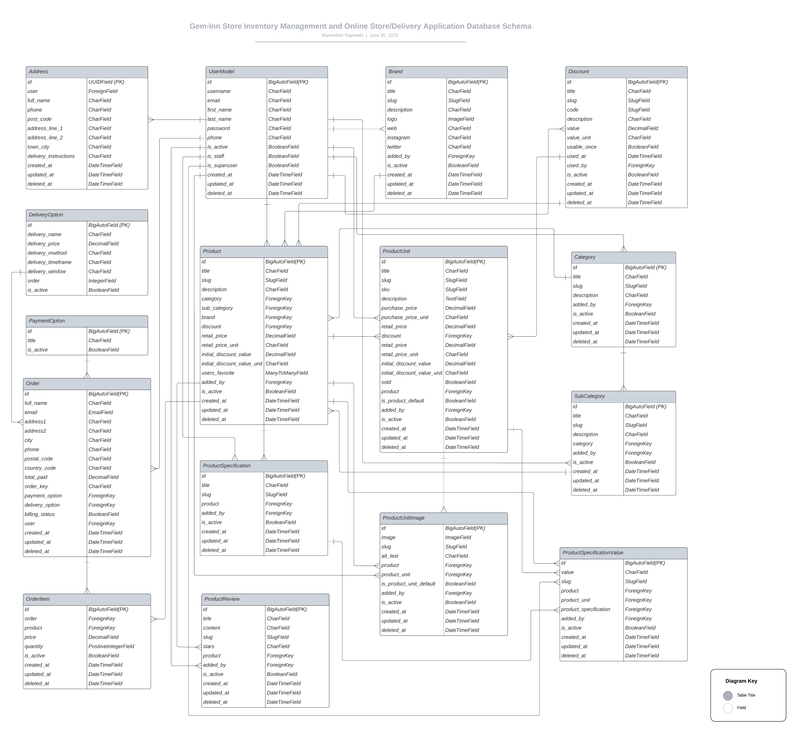

# Gem-Inn Online Jewelry Store

Guides (usage and description) to the Gem-Inn application.

**Table of Contents**

1. [What Gem-Inn Is](#what-is-gem-inn)
2. [Technologies Utilized in Crafting Gem-Inn](#technologies-utilized-in-crafting-gem-inn)
3. [Database Structure](#database-structure)
4. [How to Install and Run the Gem-Inn Application Locally On Your Device](#how-to-install-and-run-the-gem-inn-application-locally-on-your-device)
5. [Log into the Application with existing User Credentials](#log-into-the-application-with-existing-user-credentials)
6. [Files to Update for your Payment Processing Keys](#files-to-update-for-your-payment-processing-keys)
   1. [Paypal](#paypal)
   2. [Stripe](#stripe)
7. [Contributor's Words !important](#contributors-words-important)

## What Is Gem-Inn?

Gem-Inn is an online store application for jewelries and clothings with online payment channels.

## Preview (Working Application)

(gif image for preview here)

## Technologies Utilized in Crafting Gem-Inn

Gem-Inn is crafted in:

the following programming languages and frameworks:

1. **Django (Python)**
   1. **Pytest** (for comprehensive test of the application)
   2. **Coverage** to determine more tests to be ran
   3. **Selenium** for client-side UX tests
2. vanilla **JavaScript**
3. **Bootstrap 5.3**
4. vanilla **CSS3**

The online payment channels are handled by:

1. **PayPal** (credit/debit card and PayPal payments)
2. **Stripe** (credit/debit card payments) — (yet to come)

## Database Structure



## How to Install and Run the Gem-Inn Application Locally On Your Device

1. You must have Python3 downloaded and installed on your device.

   On a laptop/desktop, follow the guidelines on the official [Python website](https://www.python.org/downloads/).

   If on an Android device, follow these instructions to download and install this app, [Termux](https://github.com/termux/termux-app#f-droid). (Termux is a virtual environment for running almost all programs that could be run on a computer, on your mobile device.) After following these instructions, run the following command;
   <br />

   ```
   pkg install python
   ```

2. After installing Python3, download and install a text editor [(e.g. VS Code)](https://code.visualstudio.com/Download) if you do not have one.

   If on an Android device, follow these instructions to download and install this app, [Acode](https://acode.foxdebug.com/)

---

Then go to your terminal and follow these steps:

(For the following steps, I encourage you to use either your GitBash terminal provided by your VS Code or your Android Termux terminal, as I explain these installation steps in Linux commands. Do not use Windows Shell, unless you intend to use the synonyms (Windows translations) for these Linux commands.)

3. cd (change directory) into the folder directory from your terminal and create a folder in your favorite directory on your computer manually or you may create one from there using the following commands like below;

   ```
   cd C:/Users/maxim/Desktop
   ```

   Here I changed directory into my personal Desktop space on my windows Computer.

   If on an Android device, use these commands on the Termux shell (this gets you into your phone's internal storage file directory. And then;):

   ```
   cd /storage/emulated/0
   ```

   And then on either desktop or mobile;

   ```
   mkdir gem-inn
   ```

   Or whatever you wish to call the application

4. cd into this newly created folder

   ```
   cd gem-inn
   ```

   and create a virtual environment (skip this if on an Android device, as Termux is already a virtual environment running on your device)

   ```
   py -m venv venv
   ```

5. Activate the newly created virtual environment so that you can install Django and other dependencies.

   ```
   source venv/Scripts/activate
   ```

   You may decide to skip this step (step 5), to install and run Django from the system-wide installation. But virtual environments are always recommended.

6. Clone this repository from here on Github using either of the 2 commands on your terminal:

   ```
   git clone https://github.com/maxralph1/gem-inn.git
   ```

   or

   ```
   git clone git@github.com:maxralph1/gem-inn.git
   ```

7. Use the command below to install all dependencies I utilized in this application as can be seen from my requirements.txt file

   ```
   pip install -r requirements.txt
   ```

8. Now, cd into the geminn folder included from the cloned github repository and run the command below;

   ```
   cd geminn
   ```

   and

   ```
   py manage.py runserver
   ```

9. Finally go to your browser and visit the link:
   ```
   http://localhost:8000/
   ```
   or
   ```
   http://127.0.0.1:8000/
   ```

## Log into the Application with existing User Credentials

Use either of these credentials below to login to existing users in the database we already created.

On the other hand, if you intend to start afresh and know what you are doing, delete the database and run migrations afresh utilizing our existing database schema on this app's codebase.

For generic user:

```
Username: user
Password: password1234
```

For admin:

```
Username: admin
Password: password1234
```

## Files to Update for your Payment Processing Keys

You must update these files following these instructions, to be able to process payments.

### PayPal

(instructions here)

### Stripe

(instructions here)

## Contributor's Words !important

If you have any suggestions on how to improve this project, please share.
This application is strictly for demonstration purposes.

It is not yet production-ready and should never be used as such.

I have decided to put in my time into other projects as this isn't generating funds for me at the moment.

I will continue to gradually update this project in my free time, over a period of time (couple of months) until it is production-ready, while I handle other projects that would sustain my income.

However, if you would love to have this project completed urgently for your personal use, do not hesitate to contact me on: maxralph01@gmail.com.

\*\*On the general pattern of coding, if you noticed, the entire application has a specific approach in structure. I however decided to deviate (bring in several flavors) a little (but paid attention not to deviate too much) from these principles so as to showcase my skills.
I would stick to a particular pattern in a real-world application (N.B: my next e-commerce store before the end of 2023 would follow this strict pattern).

Finally, contributions/suggestions are welcome.
